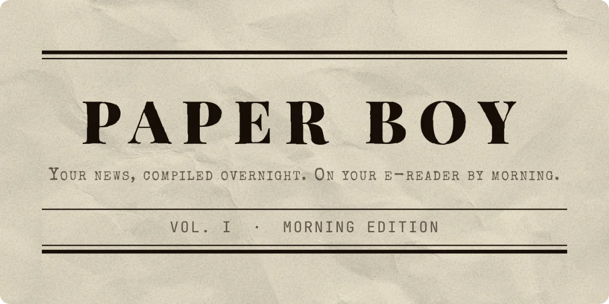
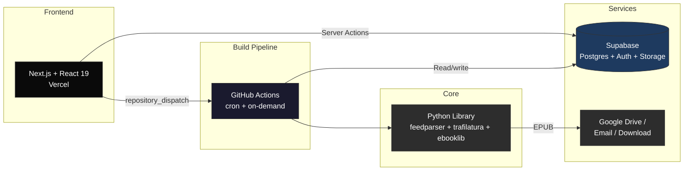

<div align="center">



Paper Boy News: Fetches news from RSS feeds, compiles a beautifully formatted EPUB, and delivers it to your Kobo, Kindle, or reMarkable before you wake up.

[](https://github.com/luclacombe/paper-boy/actions/workflows/ci.yml)
[](web/tsconfig.json)
[](https://www.paper-boy-news.com)
[](https://github.com/luclacombe/paper-boy/actions/workflows/ci.yml)

[Live Demo](https://www.paper-boy-news.com) &middot; [Report Bug](https://github.com/luclacombe/paper-boy/issues) &middot; [Request Feature](https://github.com/luclacombe/paper-boy/issues)

</div>

## Why I Built This

I wanted to read the news on my Kobo without doomscrolling on my phone. No existing solution let me pick my own sources *and* get a properly formatted newspaper delivered automatically.

Paper Boy started as a Python CLI, grew into a Streamlit prototype, and evolved into a full-stack Next.js + GitHub Actions pipeline — each iteration solving real pain points I hit as a daily user.

## How It Works

1. **Pick your sources** from 40+ curated feeds or add your own RSS URLs
2. **Choose your device** — Kobo, Kindle, reMarkable, or any EPUB reader
3. **Get your newspaper** — articles are extracted, cleaned, and optimized for e-ink
4. **Delivered automatically** via Google Drive (Kobo), email (Kindle), wireless sync (KOReader), or direct download

## Architecture



**Next.js** handles auth, onboarding, and the dashboard via Supabase. When you hit "Get it now," it fires a `repository_dispatch` event to **GitHub Actions**, which runs the **Python core library** to fetch RSS feeds, extract full article text with trafilatura, generate an e-ink-optimized EPUB with ebooklib, and deliver it to your device. Scheduled builds run via cron across 6 timezone-aware windows to deliver papers by morning worldwide.

## Features

**Web App**
- **Onboarding wizard** — 4-step setup: device, sources, delivery, first build
- **Dashboard** — 11-state status machine with async build polling, edition history, and early fetch
- **Source catalog** — 40+ curated feeds across 7 categories, starter bundles, custom RSS URLs
- **Multi-device delivery** — Google Drive (Kobo), Send-to-Kindle email, reMarkable, KOReader (OPDS wireless sync), download
- **Edition model** — timezone-aware daily editions, one per day, dedup guards
- **Settings** — batch save with undo, source management with category/frequency filters, delivery config, schedule, account

**Core Library**
- **Multi-strategy extraction** — trafilatura, readability, raw HTML fallback with domain-specific handlers
- **Content filtering** — paywall detection, junk stripping, lede dedup, quality gates
- **Smart budgeting** — frequency-aware freshness windows, time-based reading budgets, per-feed allocation
- **Image optimization** — e-ink optimized, grayscale conversion, smart cropping for covers
- **Content caching** — three-layer dedup (feeds, articles, images) across concurrent user builds

**CLI**
- **One-command builds** — `paper-boy build` generates an EPUB from your config
- **Automated delivery** — `paper-boy deliver` builds and pushes to Google Drive or email
- **YAML config** — full control over feeds, article count, delivery method, device type

**Automation**
- **Scheduled delivery** — 6 build windows (every 4 hours) + delivery checks every 30 minutes
- **On-demand builds** — trigger from the dashboard, delivered in ~2 minutes
- **Feed stats** — rolling per-feed metrics (freshness, word counts, extraction rates) for budget optimization

## Tech Stack

| Layer | Stack |
|-------|-------|
| Web app | Next.js 16, React 19, TypeScript (strict), Tailwind CSS v4, shadcn/ui |
| Auth & DB | Supabase (PostgreSQL + Auth + Storage), Drizzle ORM |
| Build pipeline | GitHub Actions (cron + `repository_dispatch`), Python scripts |
| Core library | Python 3.9+, feedparser, trafilatura, ebooklib, Pillow, Playwright |
| Testing | Vitest (225 tests) + pytest (620 tests) |
| CI/CD | GitHub Actions, Vercel (web) |

## Getting Started

### Web App (Recommended)

**[www.paper-boy-news.com](https://www.paper-boy-news.com)** — sign up and build your first edition in minutes.

#### Local development

```bash
# Prerequisites: Docker Desktop, Node.js 20+, pnpm, Supabase CLI
git clone https://github.com/luclacombe/paper-boy.git
cd paper-boy

# Start local Supabase (Postgres + Auth + Studio)
supabase start

# Start the web app
cd web
cp .env.local.example .env.local
pnpm install
pnpm dev                    # http://localhost:3000
```

Test accounts (password: `password123`): `dev@paperboy.local` / `onboarded@paperboy.local`

### CLI

```bash
pip install -e .
cp config.example.yaml config.yaml    # customize feeds + delivery
paper-boy build                        # build EPUB locally
paper-boy deliver                      # build + deliver
```

### GitHub Actions (Daily Delivery)

1. Fork this repo
2. Enable **Google Drive API** (and **Gmail API** if using email delivery) in Google Cloud Console
3. Add required GitHub Secrets (see workflow file for the full list)
4. The workflow runs every 30 minutes for scheduled delivery, or on-demand from the dashboard

## Project Structure

```
src/paper_boy/           Core Python library + CLI
scripts/                 Build runner + utility scripts (GitHub Actions)
web/                     Next.js web app (Vercel)
  src/
    actions/             Server Actions (data mutations)
    app/                 App Router pages + API routes
    components/          React components (dashboard, settings, onboarding)
    db/                  Drizzle schema + queries
    lib/                 Supabase clients, edition logic, utilities
supabase/                Migrations + seed data
tests/                   Python tests (core library)
.github/workflows/       CI + scheduled build pipeline
legacy/                  Archived prototypes (Streamlit, FastAPI)
```

## Configuration

<details>
<summary>config.yaml reference</summary>

```yaml
newspaper:
  title: "Morning Digest"
  language: "en"
  max_articles_per_feed: 10
  include_images: true

feeds:
  - name: "World News"
    url: "https://www.theguardian.com/world/rss"
  - name: "Technology"
    url: "https://feeds.arstechnica.com/arstechnica/index"

delivery:
  method: "google_drive"   # "google_drive", "email", or "local"
  device: "kobo"           # "kobo", "kindle", "remarkable", or "other"
  google_drive:
    folder_name: "Rakuten Kobo"
  email:
    smtp_host: "smtp.gmail.com"
    smtp_port: 465
    sender: ""
    password: ""           # App password, not your regular password
    recipient: ""          # e.g., your-name@kindle.com
  keep_days: 30
```

</details>

<details>
<summary>Google Drive setup</summary>

1. Go to [Google Cloud Console](https://console.cloud.google.com/)
2. Create a project and enable the **Google Drive API**
3. Set up an **OAuth 2.0 Client ID** (APIs & Services > Credentials)
4. Add `GOOGLE_CLIENT_ID` and `GOOGLE_CLIENT_SECRET` as GitHub Secrets
5. Connect Google Drive from the web app's Settings > Delivery page
6. For CLI/local use: save a service account key as `credentials.json` in the project root

</details>

<details>
<summary>Kindle (Send-to-Kindle) setup</summary>

1. Find your Kindle email in [Manage Your Content and Devices](https://www.amazon.com/hz/mycd/myx) > Preferences > Personal Document Settings
2. Add your sending email to the **Approved Personal Document E-mail List**
3. For Gmail: create an [App Password](https://myaccount.google.com/apppasswords) (requires 2-Step Verification)
4. Configure in the web app (Settings > Delivery) or in `config.yaml`

</details>

## Development

```bash
# Python core library
pip install -e ".[dev]"
pytest                       # 620 tests

# Next.js web app
cd web
pnpm dev                     # dev server
pnpm test                    # 225 tests (Vitest)
pnpm build                   # production build
pnpm lint                    # ESLint
```

See [web/CLAUDE.md](web/CLAUDE.md) for detailed web app architecture.

## License

[PolyForm Noncommercial 1.0.0](LICENSE) — free to use, modify, and distribute for noncommercial purposes.
