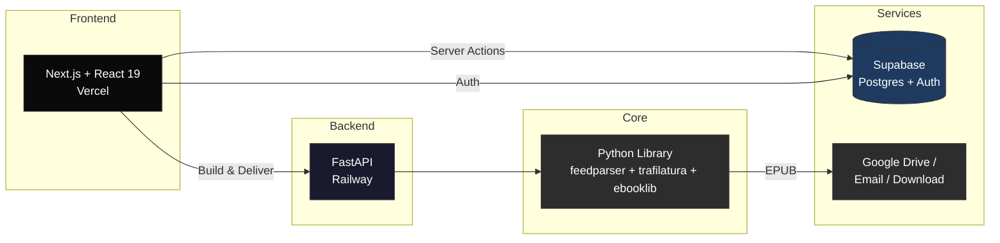

<div align="center">

# Paper Boy


Fetches news from RSS feeds, compiles a beautifully formatted EPUB, and delivers it to your Kobo, Kindle, or reMarkable before you wake up.

[](https://github.com/luclacombe/paper-boy/actions/workflows/ci.yml)
[](LICENSE)
[](https://paper-boy-news.vercel.app)
[](https://railway.app)

[Live Demo](https://paper-boy-news.vercel.app) &middot; [Report Bug](https://github.com/luclacombe/paper-boy/issues) &middot; [Request Feature](https://github.com/luclacombe/paper-boy/issues)

</div>

## Why I Built This

I wanted to read the news on my Kobo without doomscrolling on my phone. No existing solution let me pick my own sources *and* get a properly formatted newspaper delivered automatically.

Paper Boy started as a Python CLI, grew into a Streamlit prototype, and evolved into a full-stack Next.js app with a FastAPI backend — each iteration solving real pain points I hit as a daily user.

## How It Works

1. **Pick your sources** from 40+ curated feeds or add your own RSS URLs
2. **Choose your device** — Kobo, Kindle, reMarkable, or any EPUB reader
3. **Get your newspaper** — articles are extracted, cleaned, and optimized for e-ink
4. **Delivered automatically** via Google Drive (Kobo), email (Kindle), or direct download

## Architecture



**Next.js** handles auth, onboarding, and the dashboard via Supabase. When you hit "Get it now," it calls the **FastAPI** backend on Railway, which uses the **Python core library** to fetch RSS feeds, extract full article text with trafilatura, generate an e-ink-optimized EPUB with ebooklib, and push it to your device.

## Features

**Web App**
- **Onboarding wizard** — 4-step setup: device, sources, delivery, first build
- **Dashboard** — 8-state status machine with build controls and edition history
- **Source catalog** — 40+ curated feeds across 7 categories, starter bundles, custom RSS URLs
- **Multi-device delivery** — Google Drive (Kobo), Send-to-Kindle email, reMarkable, download
- **Edition model** — timezone-aware 5 AM rollover, one edition per day, dedup guards

**CLI**
- **One-command builds** — `paper-boy build` generates an EPUB from your config
- **Automated delivery** — `paper-boy deliver` builds and pushes to Google Drive or email
- **YAML config** — full control over feeds, article count, delivery method, device type

**Automation**
- **GitHub Actions** — daily cron builds at 6 AM UTC
- **Scheduled delivery** — designed for automatic morning delivery (cron implementation planned)

## Tech Stack

| Layer | Stack |
|-------|-------|
| Web app | Next.js 16, React 19, TypeScript (strict), Tailwind CSS v4, shadcn/ui |
| Auth & DB | Supabase (PostgreSQL + Auth + Storage), Drizzle ORM |
| API | FastAPI, uvicorn, deployed on Railway (Docker) |
| Core | Python 3.9+, feedparser, trafilatura, ebooklib, Pillow, click |
| Testing | Vitest (92 tests), pytest |
| CI/CD | GitHub Actions, Vercel (web), Railway (API) |

## Getting Started

### Web App (Recommended)

**[paper-boy-news.vercel.app](https://paper-boy-news.vercel.app)** — sign up and build your first edition in minutes.

#### Local development

```bash
# Prerequisites: Docker Desktop, Node.js 20+, pnpm, Supabase CLI
git clone https://github.com/luclacombe/paper-boy.git
cd paper-boy

# Start local Supabase (Postgres + Auth + Studio)
supabase start

# Start the web app
cd web
cp .env.local.example .env.local
pnpm install
pnpm dev                    # http://localhost:3000
```

Test accounts (password: `password123`): `dev@paperboy.local` / `onboarded@paperboy.local`

### CLI

```bash
pip install -e .
cp config.example.yaml config.yaml    # customize feeds + delivery
paper-boy build                        # build EPUB locally
paper-boy deliver                      # build + deliver
```

### GitHub Actions (Daily Delivery)

1. Fork this repo
2. Set up Google Drive credentials (see Configuration below) and add `GOOGLE_CREDENTIALS` secret
3. The workflow runs daily at 6 AM UTC, or trigger manually from the Actions tab

## Project Structure

```
src/paper_boy/           Core Python library + CLI
api/                     FastAPI backend (Railway)
web/                     Next.js web app (Vercel)
  src/
    actions/             Server Actions (data mutations)
    components/          React components (dashboard, settings, onboarding)
    db/                  Drizzle schema + queries
    lib/                 Supabase clients, edition logic, utilities
tests/                   Python tests (core + API)
legacy/streamlit/        Archived Streamlit prototype
.github/workflows/       CI + daily cron
```

## Configuration

<details>
<summary>config.yaml reference</summary>

```yaml
newspaper:
  title: "Morning Digest"
  language: "en"
  max_articles_per_feed: 10
  include_images: true

feeds:
  - name: "World News"
    url: "https://www.theguardian.com/world/rss"
  - name: "Technology"
    url: "https://feeds.arstechnica.com/arstechnica/index"

delivery:
  method: "google_drive"   # "google_drive", "email", or "local"
  device: "kobo"           # "kobo", "kindle", "remarkable", or "other"
  google_drive:
    folder_name: "Rakuten Kobo"
  email:
    smtp_host: "smtp.gmail.com"
    smtp_port: 465
    sender: ""
    password: ""           # App password, not your regular password
    recipient: ""          # e.g., your-name@kindle.com
  keep_days: 30
```

</details>

<details>
<summary>Google Drive setup</summary>

1. Go to [Google Cloud Console](https://console.cloud.google.com/)
2. Create a project and enable the **Google Drive API**
3. Create a **Service Account** (IAM & Admin > Service Accounts)
4. Create a JSON key for the service account
5. **Share your Google Drive folder** (e.g., "Rakuten Kobo") with the service account email
6. For GitHub Actions: add the JSON key as `GOOGLE_CREDENTIALS` repo secret
7. For local use: save as `credentials.json` in the project root

</details>

<details>
<summary>Kindle (Send-to-Kindle) setup</summary>

1. Find your Kindle email in [Manage Your Content and Devices](https://www.amazon.com/hz/mycd/myx) > Preferences > Personal Document Settings
2. Add your sending email to the **Approved Personal Document E-mail List**
3. For Gmail: create an [App Password](https://myaccount.google.com/apppasswords) (requires 2-Step Verification)
4. Configure in the web app (Settings > Delivery) or in `config.yaml`

</details>

## Development

```bash
# Python
pip install -e ".[dev]"
pytest                       # run tests

# Next.js
cd web
pnpm dev                     # dev server
pnpm test                    # Vitest (92 tests)
pnpm build                   # production build
pnpm lint                    # ESLint

# FastAPI
uvicorn api.main:app --reload   # http://localhost:8000
```

See [web/CLAUDE.md](web/CLAUDE.md) and [api/CLAUDE.md](api/CLAUDE.md) for detailed architecture docs.

## License

[PolyForm Noncommercial 1.0.0](LICENSE) — free to use, modify, and distribute for noncommercial purposes.
