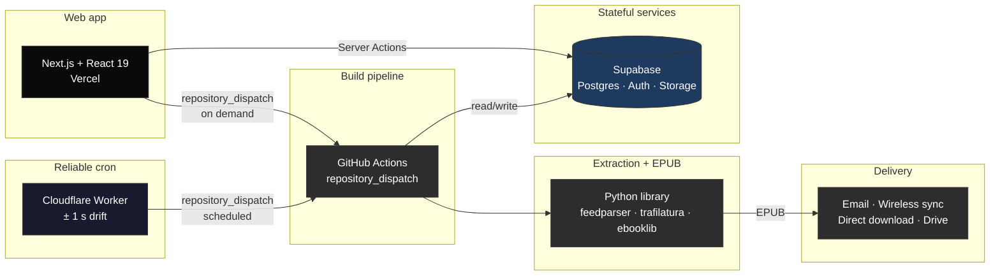

<div align="center">


Your personalized newspaper, compiled from 50+ news sources and delivered to your Kobo, Kindle, or reMarkable before you wake up.

[](https://github.com/luclacombe/paper-boy-news/actions/workflows/ci.yml)
[](web/tsconfig.json)
[](https://www.paper-boy-news.com)
[](https://github.com/luclacombe/paper-boy-news/actions/workflows/ci.yml)

[Live Demo](https://www.paper-boy-news.com) &middot; [Report Bug](https://github.com/luclacombe/paper-boy-news/issues) &middot; [Request Feature](https://github.com/luclacombe/paper-boy-news/issues)

</div>

## Why I Built This

I was following the news mostly through social media and wanted to switch to reading actual articles. I already loved my Kobo for books, so when my dad shared his FT subscription, it sparked an idea: could I get the news on my e-reader every morning?

Paper Boy started as a Python CLI, grew into a Streamlit prototype, and evolved into a full-stack Next.js + GitHub Actions pipeline. Each iteration solved real pain points I hit as a daily user.

## How It Works

1. **Pick your sources** from 50+ curated feeds or add your own RSS URLs
2. **Choose your device:** Kobo, Kindle, reMarkable, or any EPUB reader
3. **Get your newspaper:** articles are extracted, cleaned, and optimized for e-ink
4. **Delivered automatically** via email, wireless sync (KOReader/OPDS), direct download, or Google Drive — at your local delivery time, every day

## Architecture



**Next.js** handles auth, onboarding, and the dashboard via Supabase. When you hit "Get it now," it fires a `repository_dispatch` event to **GitHub Actions**, which runs the **Python core library** to extract full article text, generate an e-ink optimized EPUB, and push it to your device.

Scheduled runs are triggered by a tiny **Cloudflare Worker** instead of GitHub Actions' built-in cron — the worker fires `build` and `deliver` dispatches on time within ~1 second, while GitHub's `schedule:` trigger routinely drifts by 20+ minutes or skips slots entirely. Six build windows every 4 hours plus delivery checks every 30 minutes cover all timezones, so editions land at each user's local delivery time.

Schema migrations are deployed automatically by a separate workflow (`.github/workflows/supabase-migrate.yml`) that lints, runs a safety checker, and applies pending migrations to production after merge to `main`.

## Tech Stack

| Layer | Stack |
|-------|-------|
| Web app | Next.js 16, React 19, TypeScript (strict), Tailwind CSS v4, shadcn/ui |
| Auth & DB | Supabase (PostgreSQL + Auth + Storage), Drizzle ORM |
| Build pipeline | GitHub Actions (`repository_dispatch`), Python scripts |
| Cron triggers | Cloudflare Worker (free plan, 2 cron triggers) |
| Schema deploy | GitHub Actions + Supabase CLI (`supabase db push`) |
| Core library | Python 3.9+, feedparser, trafilatura, ebooklib, Pillow, Playwright (optional, for FT) |
| Email delivery | Resend |
| Testing | Vitest (220 tests) + pytest (743 tests) |
| CI/CD | GitHub Actions, Vercel (web) |

<details>
<summary><h2>Features</h2></summary>

**Web App**
- **Onboarding wizard:** 4-step setup for device, sources, delivery, first build
- **Dashboard:** 11-state status machine with async build polling, edition history, and early fetch
- **Source catalog:** 50+ curated feeds across 7 categories, starter bundles, custom RSS URLs
- **Multi-device delivery:** email (Kindle), wireless sync (KOReader/OPDS), direct download, Google Drive (Kobo)
- **Edition model:** timezone-aware daily editions, one per day, dedup guards
- **Settings:** batch save with undo, source management with category/frequency filters, delivery config, schedule, account

**Core Library**
- **Multi-strategy extraction:** trafilatura, browser-UA refetch, JSON-LD, Archive.today fallback, plus domain-specific handlers (FT/Bloomberg/Reuters/WaPo/Scientific American/Business of Fashion)
- **Content filtering:** paywall detection, junk stripping, lede dedup, section/trailing junk patterns, quality gates
- **Smart budgeting:** frequency-aware freshness windows, time-based reading budgets, per-feed allocation
- **Image optimization:** e-ink optimized, smart cropping for covers, recovery from raw HTML when trafilatura drops them
- **Content caching:** three-layer dedup (feeds, articles, images) across concurrent user builds
- **Idempotent email delivery:** Resend message id stored in `delivery_history`, dedupe via `Idempotency-Key` header

**CLI**
- **One-command builds:** `paper-boy build` generates an EPUB from your config
- **Automated delivery:** `paper-boy deliver` builds and pushes to Google Drive or email
- **YAML config:** full control over feeds, article count, delivery method, device type

**Automation**
- **Reliable scheduling:** Cloudflare Worker fires 6 build windows + delivery checks every 30 minutes; GitHub `schedule:` triggers are kept as a safety net
- **On-demand builds:** trigger from the dashboard, delivered in ~2 minutes
- **Auto-deploy migrations:** PRs that touch `supabase/migrations/**` get a safety report; merging to `main` runs `supabase db push --linked` against production
- **Feed stats:** rolling per-feed metrics (freshness, word counts, extraction rates) for budget optimization

</details>

## Getting Started

### Web App (recommended)

**[www.paper-boy-news.com](https://www.paper-boy-news.com)** — sign up and build your first edition in minutes.

#### Local development

```bash
# Prerequisites: Docker Desktop, Node.js 20+, pnpm, Supabase CLI
git clone https://github.com/luclacombe/paper-boy-news.git
cd paper-boy-news

# Start local Supabase (Postgres + Auth + Studio)
supabase start

# Start the web app
cd web
cp .env.local.example .env.local
pnpm install
pnpm dev                    # http://localhost:3000
```

Test accounts (password: `password123`): `dev@paperboy.local` / `onboarded@paperboy.local`

### CLI

```bash
pip install -e .
cp config.example.yaml config.yaml    # customize feeds + delivery
paper-boy build                        # build EPUB locally
paper-boy deliver                      # build + deliver
```

Email delivery uses [Resend](https://resend.com) — set `RESEND_API_KEY` in your shell. Google Drive needs `credentials.json` (service account) in the project root for CLI use.

### Self-hosted (fork + GitHub Actions)

1. Fork this repo
2. Enable **Google Drive API** in Google Cloud Console (only needed if delivering to Drive)
3. Sign up for [Resend](https://resend.com) and verify a sender domain (only needed if delivering by email)
4. Add the required GitHub Secrets — see the comments in `.github/workflows/build-newspaper.yml` for the full list
5. (Optional but recommended) Deploy a Cloudflare Worker from `cron-worker/` to replace GitHub's unreliable cron — see `cron-worker/README.md`
6. Add `SUPABASE_ACCESS_TOKEN` and `SUPABASE_DB_PASSWORD` so migrations auto-deploy on merge — see the **Release Process** section in `CLAUDE.md`

## Project Structure

```
src/paper_boy/           Core Python library + CLI
scripts/                 Build runner + utility scripts
  build_for_users.py     Build runner used by GitHub Actions
  check_migrations.py    Pre-merge safety check for SQL migrations
  seed_feed_stats.py     Populate the feed_stats table
web/                     Next.js web app (Vercel)
  src/
    actions/             Server Actions (data mutations)
    app/                 App Router pages + API routes
    components/          React components (dashboard, settings, onboarding)
    db/                  Drizzle schema + queries
    lib/                 Supabase clients, edition logic, utilities
cron-worker/             Cloudflare Worker that fires scheduled dispatches
supabase/migrations/     Versioned SQL migrations (auto-deployed on merge)
tests/                   Python tests
.github/workflows/       CI, build pipeline, schema deploy
legacy/                  Archived prototypes (Streamlit, FastAPI)
```

## Configuration

<details>
<summary>config.yaml reference (CLI)</summary>

```yaml
newspaper:
  title: "Morning Digest"
  language: "en"
  total_article_budget: 7   # ignored if reading_time_minutes is set
  reading_time_minutes: 20  # word count / 238 WPM, scarcity-aware
  include_images: true

feeds:
  - name: "World News"
    url: "https://www.theguardian.com/world/rss"
  - name: "Technology"
    url: "https://feeds.arstechnica.com/arstechnica/index"

delivery:
  method: "google_drive"   # "google_drive", "email", or "local"
  device: "kobo"           # "kobo", "kindle", "remarkable", or "other"
  google_drive:
    folder_name: "Rakuten Kobo"
    credentials_file: "credentials.json"
  email:
    recipient: "your-name@kindle.com"
  keep_days: 30
```

Email delivery requires `RESEND_API_KEY` in the environment. The web app uses the same `recipient` field plus its own Resend key set as a GitHub Secret.

</details>

<details>
<summary>Google Drive setup</summary>

1. Go to [Google Cloud Console](https://console.cloud.google.com/)
2. Create a project and enable the **Google Drive API**
3. Set up an **OAuth 2.0 Client ID** (APIs & Services → Credentials)
4. Add `GOOGLE_CLIENT_ID` and `GOOGLE_CLIENT_SECRET` as GitHub Secrets
5. Connect Google Drive from the web app's Settings → Delivery page
6. For CLI/local use: save a service account key as `credentials.json` in the project root

</details>

<details>
<summary>Kindle (Send-to-Kindle) setup</summary>

1. Find your Kindle email in [Manage Your Content and Devices](https://www.amazon.com/hz/mycd/myx) → Preferences → Personal Document Settings
2. Add **delivery@paper-boy-news.com** to your **Approved Personal Document E-mail List** (web app users) — or your own Resend sender domain (self-hosted)
3. Set the recipient in Settings → Delivery (web app) or in `config.yaml` under `delivery.email.recipient`

</details>

## Development

```bash
# Python core library
pip install -e ".[dev]"
pytest                       # 743 tests

# Next.js web app
cd web
pnpm dev                     # dev server
pnpm test                    # 220 tests (Vitest)
pnpm build                   # production build
pnpm lint                    # ESLint

# Cloudflare Worker (cron triggers)
cd cron-worker
pnpm install
pnpm test                    # Vitest under workerd via @cloudflare/vitest-pool-workers
pnpm deploy:dry              # validate wrangler config without deploying
```

Detailed docs:
- [`CLAUDE.md`](CLAUDE.md) — root overview, build pipeline, edition model, release process
- [`src/paper_boy/CLAUDE.md`](src/paper_boy/CLAUDE.md) — core library design decisions
- [`web/CLAUDE.md`](web/CLAUDE.md) — web app architecture
- [`tests/CLAUDE.md`](tests/CLAUDE.md) — test organization
- [`cron-worker/README.md`](cron-worker/README.md) — worker deploy + secret rotation

## License

[PolyForm Noncommercial 1.0.0](LICENSE). Free to use, modify, and distribute for noncommercial purposes.
